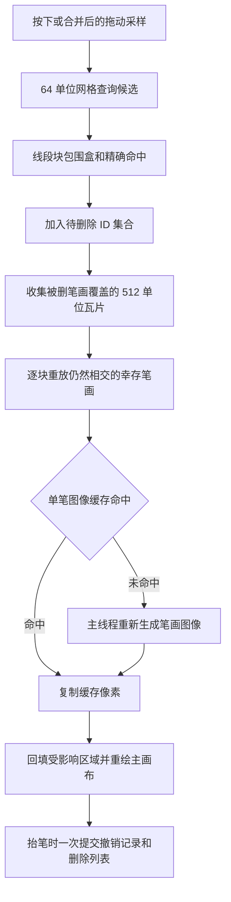
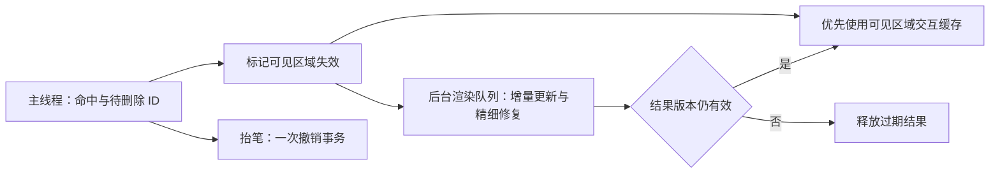

# 笔画擦除偶发卡顿：架构对照与复现

日期：2026-09-11。本轮按“先分析当前逻辑、参考成熟工具”的要求审计；修改范围是诊断基准和文档，尚未实施下文的渲染架构重构。

## 结论

当前擦除的正常路径已经较快，但最慢路径没有与输入线程隔离。**缓存未命中时，在主线程同步重建附近笔画的图像**，是已经复现的长帧来源。缓存命中率和被删除笔画的覆盖面积不同，可以使相似操作耗时从约 1 ms 跳到数百毫秒。

前几轮“热缓存下的密集擦除”基准不能证明偶发卡顿已经解决。新笔画的增量算法解决了书写时反复计算前缀的问题，但在缓存失效后，它仍需要从零重建整条已完成笔画；本轮测到该冷路径明显慢于它的热路径。

用户暂时无法区分触碰笔画时和抬笔后的停顿。以下结论区分了已经测量的原因和仍待实机轨迹验证的因素，没有将所有停顿归因于同一原因。

## 当前逻辑



入口为无限画布和 PDF 的 `eraseTopmostAt`、`flushStrokeWipe`、`applyVisualErase`。点击只处理最上层命中笔画；拖动可以命中多条，删除 ID 暂存在手势中，抬笔才写入 store。这种批量提交值得保留，不需要改成每个 pointermove 都更新 React。

`InkTileErase.ts` 负责修复。它有局部区域过滤，但工作单元仍是完整 1536×1536 像素临时瓦片，删除区域由整条被删笔画的包围盒决定。同一瓦片中的多个脏区被合成一个大矩形；处理时没有按当前视口优先排序，屏幕外受影响瓦片也会同步修复。

`InkRasterCache.ts` 只缓存每条笔画在一个文档瓦片中的包围盒图像，全局上限 64 MiB。命中时是 drawImage；未命中时生成图像、裁剪、分配 Canvas，并可能淘汰其他条目。完成笔画后已释放增量覆盖蒙版，因而版本 2 在冷路径上调用 `getStreamingInk(...).draw(...)` 时仍会从头处理它的所有采样点。一次擦除中重建的实时覆盖对象还可能留到修复批次末尾才统一释放，增加临时内存峰值。

`requestAnimationFrame` 在这里负责合并事件，**不会将回调中的耗时计算自动移到后台，也不会自动限制该帧工作量**。

## 已复现的负载差异

独立 Edge 152、Ryzen 7 7840H，羽化开启，正常文档烘焙在计时外。每个场景还原同一张初始瓦片后删除同一笔，避免把笔画数越来越少当作优化效果。

表中的“主线程调用耗时”是同步 JS/native 调用的墙钟时间；“含读回”还包含一个像素的同步读回，以暴露排队的图形工作。均不等同于真实笔尖到屏幕延迟。样本较少，用于复现和定位，不用于估计稳定尾延迟。

| 场景 | 主线程调用耗时 | 含读回耗时 | 图像缓存未命中 |
| --- | ---: | ---: | ---: |
| 128 条新版短笔画，缓存热，第二次 | 1.5 ms | 14.5 ms | 0 |
| 同样 128 条，主动清空图像缓存后 | 455.0 ms | 469.1 ms | 127 |
| 同样 128 条，再次恢复热缓存 | 1.3 ms | 13.1 ms | 0 |
| 12 条新版大范围斜线，连续三次正常擦除 | 155.5–156.3 ms | 166.8–170.2 ms | 每次 11 |
| 2 条旧格式长笔画，每条 2,048 点，热缓存第二次 | 1.3 ms | 18.0 ms | 0 |
| 同样旧长笔画，主动清空图像缓存后 | 502.4 ms | 713.2 ms | 1 |

另测 128 条旧格式短笔画：冷缓存主线程约 10.1 ms、含读回约 47.7 ms；这说明不能把所有笔刷版本、笔画长度、缓存状态混合成一个平均数。

主动清空是诊断手段，不声称应用会定期清空缓存。**12 条斜线的测试没有主动清空**，自然触发了容量不足：每条斜线的包围盒包含大量透明像素，单张缓存约 6.74 MiB；64 MiB 只能保留 9 张。按原绘制顺序扫描幸存的 11 张时，生成前面的条目挤掉后面即将读取的条目，形成循环淘汰。因此“总笔画并不算多”也可能卡。

上述场景重复运行两轮得到相近结论；原始报告保存最后一轮，包含采样和当前相关源码 SHA-256：[ink-eraser-cache-default.json](ink-eraser-cache-default.json)。

复现命令无需历史源码快照：

```powershell
$env:INK_STRESS_CASES='eraser-cache'
node scripts/benchmark-ink-stress.cjs
Remove-Item Env:INK_STRESS_CASES
```

## 与成熟工具的差异

### Xournal++：最接近本项目的整笔删除语义

其 `EraseHandler` 在命中后移除笔画对象、收集需要重绘的范围，并组织撤销记录。它同样需要重绘背景和幸存笔画，而不是把当前位置涂成背景色。[EraseHandler 源码](https://github.com/xournalpp/xournalpp/blob/master/src/core/control/tools/EraseHandler.cpp)

区别在执行分工：`addRerenderPage` 合并已有页面任务，使用紧急优先级加入 RenderJob；Scheduler 创建后台线程执行队列。RenderJob 收集待重绘矩形、重建区域缓冲，然后通过 UI 线程回调请求更新画面。[XournalScheduler](https://github.com/xournalpp/xournalpp/blob/master/src/core/control/jobs/XournalScheduler.cpp)、[Scheduler](https://github.com/xournalpp/xournalpp/blob/master/src/core/control/jobs/Scheduler.cpp)、[RenderJob](https://github.com/xournalpp/xournalpp/blob/master/src/core/control/jobs/RenderJob.cpp)

值得借鉴的是对象删除、区域失效和重绘调度的分离。不能据此声称 Xournal++ 任意密度都不卡；本轮读取的擦除代码仍先遍历当前层元素并做包围盒筛选，也不是所有成熟软件都采用同一空间索引。

### tldraw：减少参与命中和渲染的对象

tldraw 公开说明使用空间索引、视口裁剪、几何缓存和批量状态更新；v4.4.0 引入 RBush/R-tree 改善选择和擦除查询。本项目已有网格与线段块筛选，但长笔画的大包围盒仍会让许多候选落入相同网格。[性能说明](https://tldraw.dev/sdk-features/performance)、[v4.4.0 发布说明](https://tldraw.dev/releases/v4.4.0)

它保留独立图形的渲染表示，屏幕外对象可以隐藏；本项目把多条墨迹预先混到同一张 Canvas 瓦片，删除对象后还必须恢复被遮挡内容。可借鉴对象级缓存和可见区域优先，但直接增加 R-tree 不能消除上表的图像重建成本。大量笔画真正重叠时，R-tree 也必须返回这些相交候选。

### Krita：反馈与精细计算分离

Krita 官方的 Instant Preview 在较小画布上提供反馈，实际精细笔画在后台计算。它是有条件生效的机制；原分辨率显示和部分笔刷设置下收益有限。[Instant Preview 官方说明](https://docs.krita.org/en/reference_manual/instant_preview.html)

这是渲染调度思路的参考，不是相同功能的速度对照。Krita 的像素擦除与本项目按对象删除整笔不同；本项目不能直接抹掉删除笔画经过的全部像素，否则会损坏其他交叠笔画和 PDF 背景。

## 建议采用的实现方案

优先级按本轮证据排序。以下是针对本项目的设计建议，不宣称参考工具采用了完全相同的实现。

1. **将冷缓存重建和精细修复移入渲染 Worker。** 主线程保留轻量命中、待删除 ID 和一次手势的撤销提交；渲染端持有稳定场景数据，按增量消息更新，避免每次移动复制整个文档。使用 OffscreenCanvas/ImageBitmap 等独立渲染缓冲，通过消息交回可显示结果。不能仅在 setTimeout/rAF 中包装原来的整批重绘。
2. **缓存改为稀疏小块，并优先保留当前可见的交互结果。** 以笔画实际经过的小块而非整个大包围盒分配图像，减少透明区域浪费；区分当前视口、离屏内容和撤销历史的缓存优先级。为工作集设置明确预算和防循环淘汰策略。单纯扩大 64 MiB 只能推迟触发容量问题。
3. **屏幕反馈与 3 倍精细瓦片分开调度。** 交互期间优先合成可见区域、与显示分辨率匹配的缓存；后台补齐高精度结果。每次删除附带页面/场景版本和瓦片修订号，新结果到达时只接受当前版本，防止快速连续擦除、撤销或切页后旧任务把笔画画回来。仅迁移到 Worker 能减少输入冻结，但后台计算仍慢时，笔画消失依然可能延迟，因此必须同时处理缓存和反馈速度。
4. **重绘队列按可见脏区拆分、合并和取消。** 光标附近优先，其他可见区域其次，离屏最后；不把相隔很远的小脏区一律扩大成整块矩形。对任务大小设上限，避免一个任务堵住全部队列。保持原笔画顺序、透明度和自由橡皮擦痕语义。
5. **补齐阶段计时，再处理剩余命中和抬笔成本。** 单独记录点击/拖动命中、图像缓存未命中与淘汰、冷图像生成、合成、抬笔 store 提交、索引清理及保存。现有 worstScan 只记录拖动，点击扫描与抬笔清理没有完整覆盖，不能靠现有日志排除它们。必要时再将网格升级为空间树、增加线段级索引或按手势路径分段查询。



## 抬笔卡顿的判断边界

无限画布保存已经在指针按下期间延后，落笔期间的自动 JSON 序列化不应被当作当前主要原因。抬笔后的 store 数组过滤、两个状态更新、索引清理及 React 重新执行仍是同步工作；无限画布约 1 秒后保存也仍使用 JSON.stringify/localStorage。PDF 保存路径与无限画布不同，不能假定它们有同样的自动保存时序。这些步骤需要实际窗口轨迹才能确认占比。

本轮已证明冷缓存和容量循环淘汰会触发长任务；未声称完成用户窗口的端到端定位，也未声称新的后台渲染方案已经接入。后续验收应同时报告输入响应时间和命中到笔画消失的时间，覆盖热/冷缓存、超出预算、旧长笔画、快速反向拖动、撤销重做、切页及抬笔保存，并检查 P95/P99 和最长帧，不能只比较平均耗时。

## 后续修复（同日）：缓解容量循环淘汰

上文的诊断未改动代码。随后实施了一轮**缓解**，不改动渲染架构，目标是消除"容量循环淘汰"这一条已复现路径。

改动：

1. `InkRasterCache.ts` 的缓存上限由 64 MiB 提高到 256 MiB。上限是天花板而非预分配，墨迹少的文档用量不变。这是上表 `budget-thrash`（12 条斜线，单张约 6.74 MiB，64 MiB 仅容 9 张）触发循环淘汰的直接原因。
2. `StreamingInkStroke.ts` 由裸 `WeakMap` 改为带字节计账的 LRU（96 MiB），并移除 `stampCachedStroke` 与 `eraseStrokeRegions` 中提交/修复后立即 `releaseStreamingInk` 的调用。命中失败时的回退因此从"按原始点重建整条笔画"变为"从仍存活的流式瓦片重新合成"，隔离测量为 71.8 ms → 1.35 ms（marker）。

重新运行同一基准（`INK_STRESS_CASES='eraser-cache'`，Edge 152，Ryzen 7 7840H），结果覆盖到 [ink-eraser-cache-default.json](ink-eraser-cache-default.json)：

| 场景 | 条件 | 主线程调用耗时（前 → 后） | 图像缓存未命中（前 → 后） |
| --- | --- | ---: | ---: |
| budget-thrash | normal-1 | 156.2 ms → **0.1 ms** | 11 → **0** |
| budget-thrash | normal-2 | 156.3 ms → **1.3 ms** | 11 → **0** |
| budget-thrash | normal-3 | 155.5 ms → **1.2 ms** | 11 → **0** |
| cold-v2 | forced-cold | 455.0 ms → 339.3 ms | 127 → 127 |
| long-legacy | forced-cold | 502.4 ms → 557.9 ms | 1 → 1 |
| 其余热缓存条件 | — | 约 1 ms，无变化 | 0 |

**边界**：`forced-cold` 是主动清空缓存的诊断条件，应用不会定期清空，这一列仍然慢，符合"冷缓存重建在主线程"的判断。`long-legacy` 只有单个样本，前后差异属于噪声，不声称改善或恶化。

**未解决**：上文建议第 2 条已写明"单纯扩大 64 MiB 只能推迟触发容量问题"，本轮正是该措施，因此容量问题被推后而非消除；工作集继续增大（大量笔画在单个 512 单位瓦片内完全重叠）仍会重新进入淘汰。建议 1（Worker 隔离）、3（反馈与精细瓦片分离调度）、4（脏区拆分与取消）、5（补齐点击与抬笔阶段计时）均未实施。第 2 条中"以笔画实际经过的小块分配图像"也未实施——当前仍按包围盒裁剪，每条斜线单张约 6.74 MiB 中大部分是透明像素。
